# HuduGlue 🐕

[](https://github.com/agit8or1/huduglue)
[](https://github.com/agit8or1/huduglue)
[](LICENSE)
[](https://www.djangoproject.com/)
[](https://www.python.org/)
[](https://snyk.io/test/github/agit8or1/huduglue)
[](https://github.com/agit8or1/huduglue)

A complete, self-hosted IT documentation platform designed for Managed Service Providers (MSPs) and IT departments. Built with Django 6, HuduGlue provides secure asset management, encrypted password vault, knowledge base, PSA integrations, and comprehensive monitoring tools.

## 📸 Screenshots

*All screenshots include demo data and are watermarked. Random background feature enabled. [View full gallery →](docs/screenshots/)*

<table>
<tr>
<td width="50%">

### 🏠 Dashboard & Quick Access

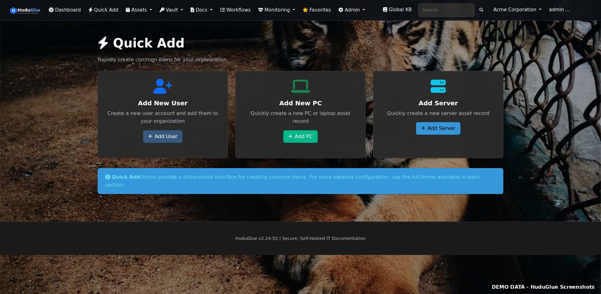

</td>
<td width="50%">

### 📦 Asset Management
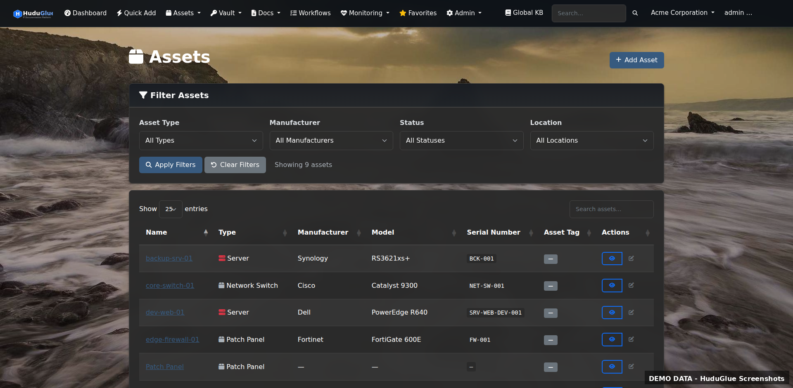
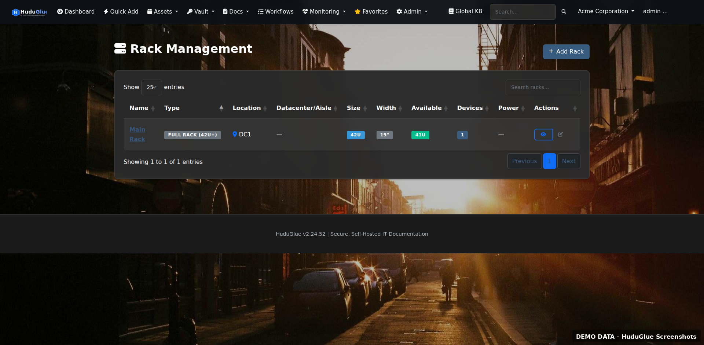

</td>
</tr>
<tr>
<td width="50%">

### 🔐 Password Vault & Security
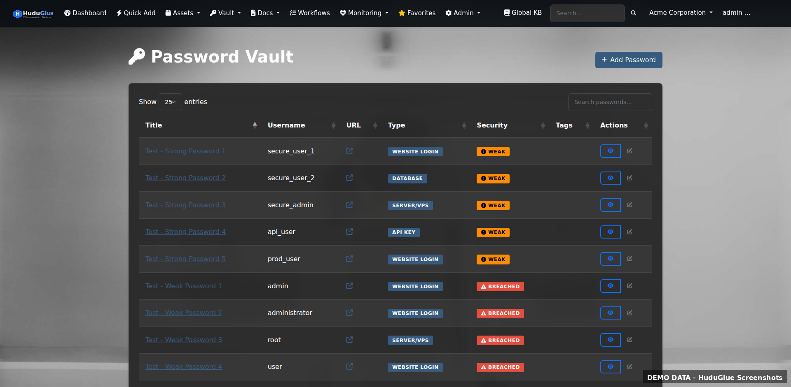
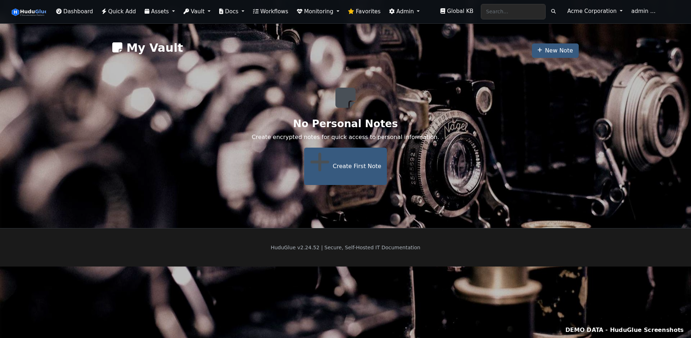

</td>
<td width="50%">

### 📚 Documentation & Knowledge Base
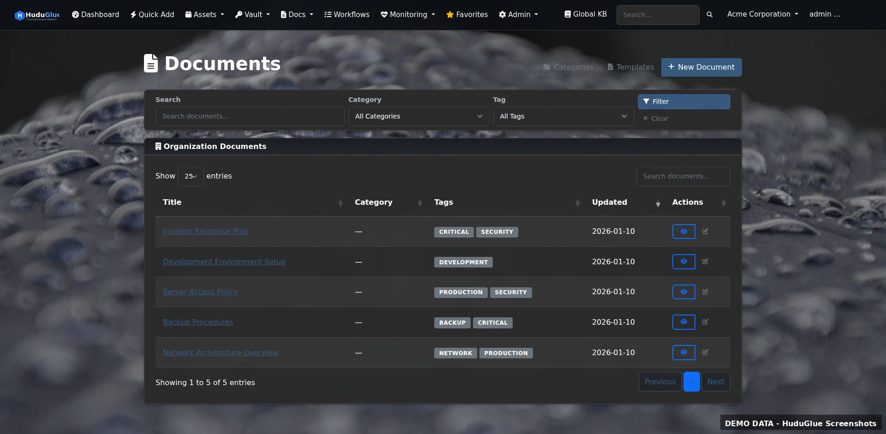
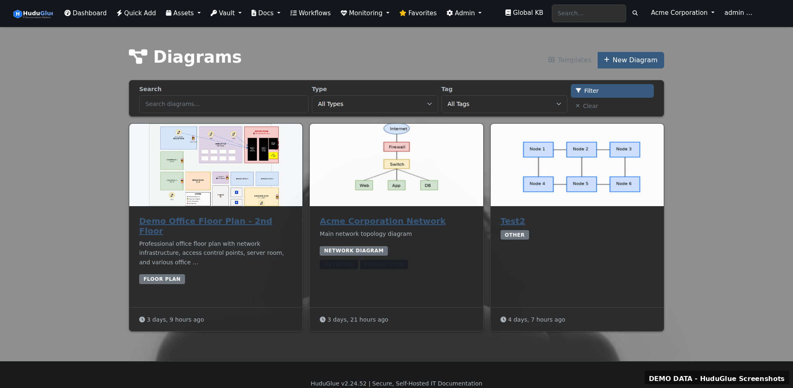

</td>
</tr>
<tr>
<td width="50%">

### 🔒 Security Dashboard
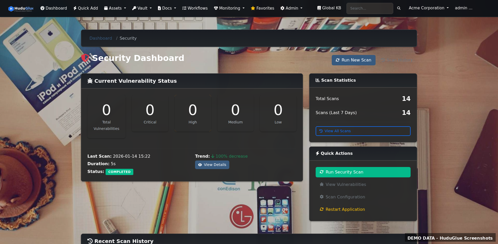


</td>
<td width="50%">

### 🌐 Monitoring

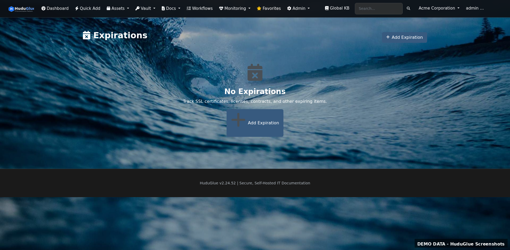

</td>
</tr>
<tr>
<td width="50%">

### ⚙️ System Management
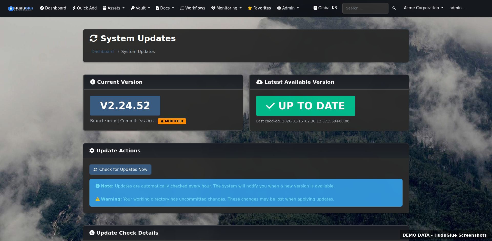
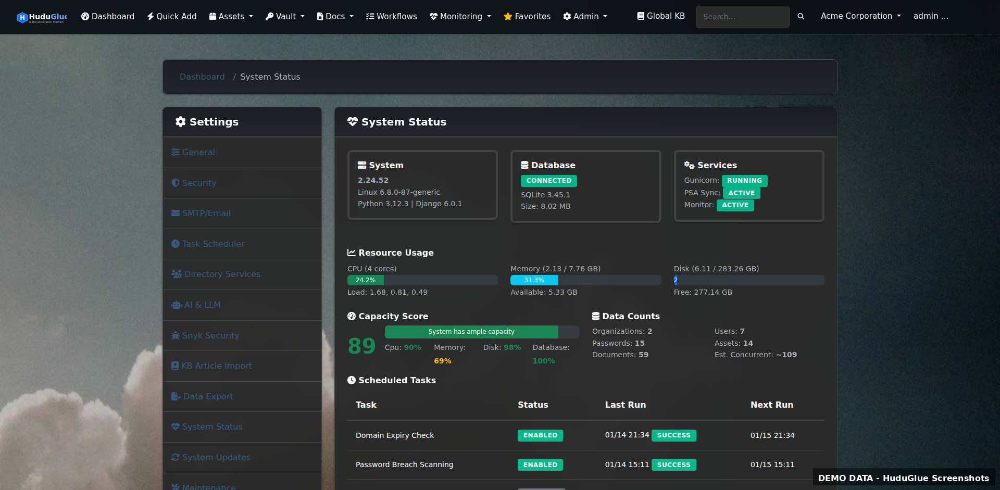

</td>
<td width="50%">

### 🏢 Multi-Tenancy & Access
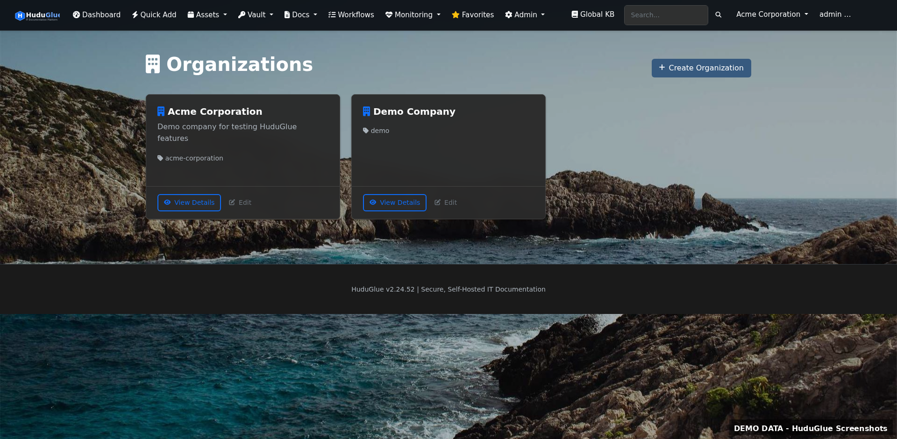
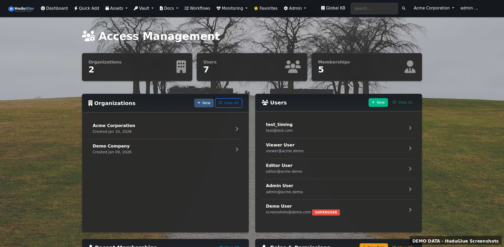

</td>
</tr>
</table>

<details>
<summary><strong>📋 View All Screenshots (34 total)</strong></summary>

### Core Features
- [Dashboard](docs/screenshots/dashboard.png) - Main dashboard with random backgrounds
- [Quick Add](docs/screenshots/quick-add.png) - Fast creation menu for assets, passwords, documents
- [About](docs/screenshots/about-page.png) - System information and version details
- [Profile](docs/screenshots/profile.png) - User profile and settings
- [Favorites](docs/screenshots/favorites.png) - Quick access to favorited items

### Asset Management
- [Assets List](docs/screenshots/assets-list.png) - Comprehensive asset tracking
- [Racks](docs/screenshots/racks.png) - Rack management with U-space tracking
- [Network Closets](docs/screenshots/network-closets.png) - Network infrastructure management
- [IPAM/Subnets](docs/screenshots/ipam-subnets.png) - IP address management
- [VLANs](docs/screenshots/vlans.png) - VLAN configuration and tracking
- [Locations](docs/screenshots/locations.png) - Physical location management

### Password Vault
- [Password Vault](docs/screenshots/password-vault.png) - AES-256-GCM encrypted password storage
- [Personal Vault](docs/screenshots/personal-vault.png) - Private user password vault
- [Secure Notes](docs/screenshots/secure-notes.png) - Encrypted ephemeral messaging

### Documentation & Diagrams
- [Knowledge Base](docs/screenshots/knowledge-base.png) - Document management system
- [Diagrams](docs/screenshots/diagrams.png) - Draw.io integrated diagramming
- [Floor Plans Import](docs/screenshots/floor-plans-import.png) - MagicPlan floor plan import

### Workflows & Processes
- [Workflows](docs/screenshots/workflows.png) - Process automation and tracking

### Monitoring & Expirations
- [Website Monitors](docs/screenshots/website-monitors.png) - Uptime monitoring dashboard
- [Expirations](docs/screenshots/expirations.png) - SSL, domain, and credential expiration tracking

### Security & Scanning
- [Security Dashboard](docs/screenshots/security-dashboard.png) - Security overview and vulnerability status
- [Vulnerability Scans](docs/screenshots/vulnerability-scans.png) - Snyk scan history
- [Scan Configuration](docs/screenshots/scan-configuration.png) - Security scan settings

### System Administration
- [Settings](docs/screenshots/settings-general.png) - General system configuration
- [System Status](docs/screenshots/system-status.png) - Health monitoring and scheduled tasks
- [System Updates](docs/screenshots/system-updates.png) - One-click update system
- [Organizations](docs/screenshots/organizations.png) - Multi-tenant organization management
- [Access Management](docs/screenshots/access-management.png) - User and role management
- [Integrations](docs/screenshots/integrations.png) - PSA and external integrations
- [Import Data](docs/screenshots/import-data.png) - Bulk data import tools

### MSP/Global Features (Staff Only)
- [Global Dashboard](docs/screenshots/global-dashboard.png) - Cross-organization overview
- [Global KB](docs/screenshots/global-kb.png) - Internal staff documentation
- [Global Workflows](docs/screenshots/global-workflows.png) - Reusable process templates

</details>

## 🐕 About Luna

This project was developed with the assistance of **Luna**, a brilliant German Shepherd Dog with exceptional problem-solving abilities and a keen eye for security best practices. Luna's contributions to code review, architecture decisions, and bug hunting have been invaluable.

## ✨ Key Features

### 🔐 Security & Authentication
- **Azure AD / Microsoft Entra ID SSO** with auto-user creation
- **LDAP/Active Directory** enterprise integration
- **Enforced TOTP 2FA** with SSO bypass
- **AES-GCM Encryption** for all sensitive data
- **Password Breach Detection** via HaveIBeenPwned (k-anonymity)
- **Snyk Security Scanning** with automated CVE detection
- **Rate Limiting**, CSRF, XSS, SQL injection, SSRF, path traversal protection

### 🏢 Multi-Tenancy & Access Control
- **Complete Organization Isolation** with 42 granular permissions
- **Four-Tier Access Levels** - Owner, Admin, Editor, Read-Only
- **MSP User Types** - Staff (global) and Organization (scoped) users

### 📦 Core Platform
- **Auto-Update System** - One-click web updates (20-30 seconds, no SSH)
- **Asset Management** - Comprehensive tracking with NetBox-style rack visualization
- **Password Vault** - AES-GCM encrypted with breach detection, personal vaults, and Bitwarden import
- **Bitwarden Import** - Import passwords from Bitwarden/Vaultwarden JSON exports (logins, notes, cards, identities, folders, custom fields, TOTP)
- **SMS/Navigation** - Send location navigation links via SMS (Twilio, Plivo, Vonage, Telnyx, AWS SNS)
- **Documentation** - Per-org docs with version control, templates, and global MSP knowledge base
- **Diagrams & Floor Plans** - Draw.io integration, MagicPlan import, auto-generated flowcharts
- **Infrastructure** - IPAM, rack visualization, network documentation, cable/power management
- **Monitoring** - Website uptime, SSL certificates, domain expiration, custom alerts
- **Workflows** - Process automation with audit logging, PSA integration, execution tracking
- **Firewall Management** - iptables firewall rules, GeoIP country blocking, IP whitelist/blacklist
- **Intrusion Prevention** - Fail2ban integration with ban management and IP checking

### 🔌 Integrations
- **8 PSA Providers** - ConnectWise, Autotask, HaloPSA, Kaseya BMS, Syncro, Freshservice, Zendesk, ITFlow
- **5 RMM Providers** - Tactical RMM (full), NinjaOne, Datto, Atera, CW Automate (infrastructure ready)
- **Organization Auto-Import** - Automatically create orgs from PSA companies or RMM sites
- **Asset Mapping** - Auto-link RMM devices to assets

**For complete feature details, see [FEATURES.md](FEATURES.md)**

## 🆕 What's New

### Latest Release - v2.27.1 (January 2026)

**🎉 New in v2.27:**
- **Bitwarden/Vaultwarden Import** - Import passwords from Bitwarden/Vaultwarden JSON exports with full support for all item types (logins, notes, cards, identities), folders, custom fields, and TOTP secrets
- **SMS/Navigation Links** - Send location navigation links via SMS using Twilio, Plivo, Vonage, Telnyx, or AWS SNS for Google Maps, Apple Maps, and Waze
- **Global View Improvements** - Superusers can now access workflow executions and locations without organization context
- **Firewall & GeoIP** - iptables-based firewall management with country blocking capabilities
- **Fail2ban Integration** - Automated intrusion prevention with ban/unban management

**Recent Highlights:**
- **User-Configurable Tooltips** - Per-user tooltip preferences with helpful hints throughout the interface
- **RMM Device Location Mapping** - Display devices with location data on interactive map with status-based markers
- **Workflow Automation** - One-click launch with automatic assignment, complete audit logging, PSA ticket integration
- **Execution Tracking** - Full history view with filtering, color-coded status badges, progress bars
- **Auto-Update System** - One-click web updates with real-time progress (20-30 seconds, no SSH required)
- **Azure AD SSO** - Single sign-on with Microsoft accounts
- **Organization Auto-Import** - Automatically create organizations from PSA/RMM systems
- **Security Scanning** - Snyk vulnerability scanning, HaveIBeenPwned password breach detection

**For complete version history, see [CHANGELOG.md](CHANGELOG.md)**

## 🚀 Quick Start

### One-Line Installation (Recommended)

The easiest way to install HuduGlue:

```bash
git clone https://github.com/agit8or1/huduglue.git && cd huduglue && bash install.sh
```

This automated installer will:
- ✅ Install all prerequisites (Python 3.12, pip, venv, MariaDB server & client)
- ✅ Create virtual environment and install dependencies
- ✅ Generate secure encryption keys automatically
- ✅ Create `.env` configuration file
- ✅ Setup database and user
- ✅ Create log directory
- ✅ Run migrations
- ✅ Create superuser account
- ✅ Collect static files
- ✅ **Start production server automatically** (Gunicorn with systemd)
- ✅ **Configure auto-update permissions** (sudoers for one-click web updates)

**When the installer finishes, your server is RUNNING and ready to use!**

### Smart Detection

The installer automatically detects existing installations and offers:

1. **Upgrade/Update** - Pull latest code, run migrations, restart service (zero downtime)
2. **System Check** - Verify all components are working properly
3. **Clean Install** - Remove everything and reinstall from scratch
4. **Exit** - Leave existing installation untouched

No manual cleanup needed! The installer handles everything.

### Web-Based Auto-Update (NEW in 2.14.21!)

Once installed, you can update HuduGlue **directly from the web interface**:

1. Navigate to **System Settings → System Updates**
2. Click **"Check for Updates Now"** to detect new versions
3. Click **"Apply Update"** when an update is available
4. Watch real-time progress through all 5 steps:
   - Step 1: Git Pull
   - Step 2: Install Dependencies
   - Step 3: Run Migrations
   - Step 4: Collect Static Files
   - Step 5: Restart Service
5. Page automatically reloads with the new version (20-30 seconds total)

**No SSH access required!** Non-technical users can update safely from the web interface.

**System Requirements:**
- Ubuntu 20.04+ or Debian 11+
- 2GB RAM minimum (4GB recommended)
- Internet connection for package installation

### Optional Features

#### LDAP/Active Directory Integration

By default, HuduGlue installs with Azure AD SSO support but **without** LDAP/Active Directory. This is because LDAP requires C compilation and system libraries.

**If you need LDAP/AD support**, install it after the main installation:

```bash
# Install system build dependencies
sudo apt-get update
sudo apt-get install -y build-essential python3-dev libldap2-dev libsasl2-dev

# Install LDAP Python packages
cd ~/huduglue
source venv/bin/activate
pip install -r requirements-optional.txt
sudo systemctl restart huduglue-gunicorn.service
```

**Note:** Azure AD SSO does **not** require these packages. LDAP is only needed for on-premises Active Directory or other LDAP servers.

### Manual Installation

If you prefer to install manually or need more control:

<details>
<summary>Click to expand manual installation steps</summary>

#### Prerequisites
- Python 3.12+
- MariaDB 10.5+ or MySQL 8.0+
- Nginx (production only)

```bash
# 1. Clone repository
git clone https://github.com/agit8or1/huduglue.git
cd huduglue

# 2. Install system dependencies
sudo apt-get update
sudo apt-get install -y python3.12 python3.12-venv python3-pip mariadb-client mariadb-server

# 3. Create virtual environment
python3.12 -m venv venv
source venv/bin/activate

# 4. Install Python dependencies
pip install --upgrade pip
pip install -r requirements.txt

# 5. Generate secrets
python3 -c "from cryptography.fernet import Fernet; print('APP_MASTER_KEY=' + Fernet.generate_key().decode())"
python3 -c "import secrets; print('SECRET_KEY=' + secrets.token_urlsafe(50))"
python3 -c "import secrets; print('API_KEY_SECRET=' + secrets.token_urlsafe(50))"

# 6. Create .env file
# Copy the generated secrets from step 5 into this file
cat > .env << 'EOF'
DEBUG=True
SECRET_KEY=<paste_secret_key_here>
ALLOWED_HOSTS=localhost,127.0.0.1

DB_NAME=huduglue
DB_USER=huduglue
DB_PASSWORD=your_secure_password
DB_HOST=localhost
DB_PORT=3306

APP_MASTER_KEY=<paste_master_key_here>
API_KEY_SECRET=<paste_api_key_secret_here>

EMAIL_BACKEND=django.core.mail.backends.console.EmailBackend
SITE_NAME=HuduGlue
SITE_URL=http://localhost:8000
EOF

# 7. Start MariaDB and create database
sudo systemctl start mariadb
sudo mysql << 'EOSQL'
CREATE DATABASE huduglue CHARACTER SET utf8mb4 COLLATE utf8mb4_unicode_ci;
CREATE USER 'huduglue'@'localhost' IDENTIFIED BY 'your_secure_password';
GRANT ALL PRIVILEGES ON huduglue.* TO 'huduglue'@'localhost';
FLUSH PRIVILEGES;
EOSQL

# 8. Run migrations
python3 manage.py migrate

# 9. Create superuser
python3 manage.py createsuperuser

# 10. Collect static files
python3 manage.py collectstatic --noinput

# 11. Run development server
python3 manage.py runserver 0.0.0.0:8000
```

Visit `http://localhost:8000` and log in with the credentials you created in step 9.

</details>

## 📚 Documentation

**Installation:**
- **[INSTALL.md](INSTALL.md)** - Complete installation guide (quick start, upgrade, troubleshooting)

**Core Documentation:**
- **[ORGANIZATIONS.md](ORGANIZATIONS.md)** - Complete guide to organizations, user types, roles, and permissions
- **[SECURITY.md](SECURITY.md)** - Security best practices and vulnerability disclosure
- **[CONTRIBUTING.md](CONTRIBUTING.md)** - Development and contribution guidelines
- **[CHANGELOG.md](CHANGELOG.md)** - Version history and release notes
- **[deploy/](deploy/)** - Production deployment configs (Nginx, Gunicorn, systemd services)

## 🏗️ Architecture

### Technology Stack
- **Framework**: Django 6.0
- **API**: Django REST Framework 3.15
- **Database**: MariaDB 10.5+ (MySQL 8.0+ supported)
- **Web Server**: Nginx + Gunicorn
- **Authentication**: django-two-factor-auth (TOTP)
- **Encryption**: Python cryptography (AES-GCM)
- **Password Hashing**: Argon2
- **Frontend**: Bootstrap 5, vanilla JavaScript

### Design Philosophy
- ✅ **No Docker** - Pure systemd deployment
- ✅ **No Redis** - systemd timers for scheduling
- ✅ **Minimal Dependencies** - Only essential packages
- ✅ **Security First** - Built with security in mind
- ✅ **Self-Hosted** - Complete data control

## 🔒 Security

HuduGlue has undergone comprehensive security auditing and continuous vulnerability monitoring:

### Continuous Security Monitoring
- ✅ **Automated CVE Scanning** - Codebase scanned for known vulnerabilities and CVEs
- ✅ **AI-Assisted Detection** - Pattern matching for SQL injection, XSS, CSRF, path traversal
- ✅ **Dependency Monitoring** - Python packages checked against security advisories
- ✅ **Weekly Manual Audits** - Regular security reviews by development team
- ✅ **Alert-Only System** - No automated code changes, human verification required

### Fixed Vulnerabilities
- ✅ SQL Injection - Parameterized queries and identifier quoting
- ✅ SSRF - URL validation with IP blacklisting
- ✅ Path Traversal - Strict file path validation
- ✅ IDOR - Object access verification
- ✅ Insecure File Uploads - Type, size, and extension validation
- ✅ Hardcoded Secrets - Environment variable enforcement
- ✅ Weak Encryption - AES-GCM with validated keys
- ✅ CSRF Protection - Multi-domain support

### Security Features
- All passwords encrypted with AES-GCM
- API keys hashed with HMAC-SHA256
- Rate limiting on all endpoints
- Brute-force protection
- Security headers (CSP, HSTS)
- Private file serving
- Audit logging
- Password breach detection (HaveIBeenPwned integration)

**Security Disclosure**: If you discover a vulnerability, please email agit8or@agit8or.net. See [SECURITY.md](SECURITY.md) for details.

## 🤝 Contributing

We welcome contributions! Here's how you can help:

### 💡 Feature Requests & Ideas

Have an idea for a new feature? We use a community-driven voting system:

1. **Start with a Discussion** → [Share your idea](https://github.com/agit8or1/huduglue/discussions/new?category=ideas)
2. **Vote on existing ideas** → [Browse and upvote](https://github.com/agit8or1/huduglue/discussions/categories/ideas) (👍 reactions)
3. **Track the Roadmap** → [View what's being built](https://github.com/agit8or1/huduglue/projects)

Popular ideas (high votes + alignment with project goals) are promoted to Feature Request issues and added to the Roadmap.

📖 **Read the full guide:** [docs/FEATURE_REQUESTS.md](docs/FEATURE_REQUESTS.md)

### 🐛 Bug Reports

Found a bug? [Report it here](https://github.com/agit8or1/huduglue/issues/new?template=bug_report.yml)

### 🔨 Code Contributions

Ready to contribute code? See [CONTRIBUTING.md](CONTRIBUTING.md) for guidelines.

### Development Setup

```bash
# 1. Fork and clone
git clone https://github.com/agit8or1/huduglue.git
cd huduglue

# 2. Create feature branch
git checkout -b feature/amazing-feature

# 3. Make changes and test
python3 manage.py test

# 4. Commit and push
git commit -m 'Add amazing feature'
git push origin feature/amazing-feature

# 5. Open Pull Request
```

## 📝 License

This project is licensed under the MIT License - see the [LICENSE](LICENSE) file for details.

## 🙏 Acknowledgments

- **Luna the GSD** - Development assistance, security review, and bug hunting
- **Django & DRF** - Excellent web framework
- **Bootstrap 5** - Beautiful, responsive UI
- **Font Awesome** - Icon library
- **Community** - All contributors and users

## 📊 Project Status

- **Version**: 2.25.1
- **Release Date**: January 2026
- **Status**: Production Ready
- **Maintained**: Yes
- **Security**: Snyk monitored, HaveIBeenPwned integrated

## 💬 Support

- **Issues**: [GitHub Issues](https://github.com/agit8or1/huduglue/issues)
- **Discussions**: [GitHub Discussions](https://github.com/agit8or1/huduglue/discussions)
- **Security**: See [SECURITY.md](SECURITY.md) for vulnerability disclosure

## 💝 Supporting This Project

If you find HuduGlue useful for your MSP or IT department, please consider supporting the developer's business: **[MSP Reboot](https://www.mspreboot.com)** - Professional MSP services and consulting.

Your support allows me to continue developing open-source tools like HuduGlue and contribute to the MSP community. Thank you!

## 🗺️ Roadmap

- [ ] Mobile-responsive UI improvements
- [ ] Advanced reporting and analytics
- [ ] Backup/restore functionality
- [ ] Docker deployment option (optional)
- [ ] Additional PSA/RMM integrations
- [ ] API v2 with GraphQL
- [x] MagicPlan floor plan integration
- [ ] Mobile app

## ⚡ Performance

- Handles 1000+ assets per organization
- Sub-second page load times
- Efficient database queries
- Optimized for low-resource environments
- Horizontal scaling support

---

**Made with ❤️ and 🐕 by the HuduGlue Team and Luna the German Shepherd**
